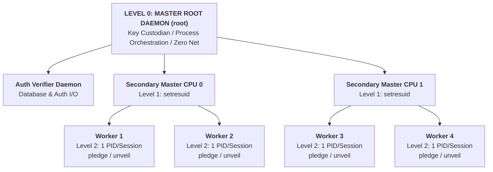
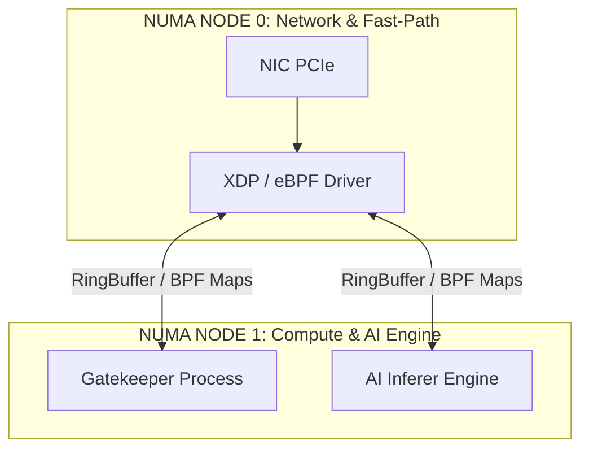

## XDP Asymmetric Defense System (Linux) + OpenBSD for L7 Protection with Three-Table Architecture (handshake, unauth, session), Privilege Separation and TLS Tarpit

---

## 1. Initial Inspection, Dynamic Handshake Throttling and SYN Forwarding (BoxA:WAN)

On the external interface **BoxA:WAN**, in addition to the usual header field validation check, blacklist verification and rate limiting are performed exclusively on SYN packets, passing through a pipeline before any stateful processing:

* **RTBH / FIB Reverse Lookup (Zero Maps):** XDP performs a Reverse Route Lookup via the helper function `bpf_fib_lookup()`, checking the route for the packet's source IP. If the source IP falls within a prefix advertised via BGP as `blackhole` or `unreachable`, the packet is instantly dropped (`XDP_DROP`). 
* **Hostile Host Filter (`map_ip_trespass_v4 / v6`):** Direct-access HASH control containing **exclusively individual Host IPs (`/32` or `/128`)** blocked permanently or administratively/cumulatively. CIDR networks are delegated entirely to the BGP/RTBH layer.
* **Temporary Blacklist (`map_blacklist_v4 / v6`):** If the client tuple (`session_key_v4 / v6`) is blacklisted and the current time is less than the expiration timestamp (`until_when_ns`), the packet is dropped (`XDP_DROP`).
* **Stateless Dynamic Handshake Throttling (`map_pending_handshake_v4 / v6`):** To prevent socket exhaustion on OpenBSD and limit simultaneous or brute-force TCP handshake attacks from single IPs, XDP applies a **Token Bucket / Leaky Bucket** algorithm on the `pending_handshake_count` counter:
  * **Burst Capacity & Ordinary State (`pending_handshake_count < B_MAX`):** Allows an instantaneous burst of concurrent negotiations (e.g., $B_{MAX} = 10 \div 30$) from the same source IP. This prevents *Self-DoS* of legitimate clients behind the same NAT/corporate router following reboots or line failovers. SYN packets are forwarded at line rate (`XDP_REDIRECT`).
  * **Leaky Rate & Fast-Clear:** The counter is refilled/drained at a strict time interval (e.g., $30/\text{minute}$). As soon as a session passes the `AUTH_UN` probe or completes TLS, the token is immediately returned to the IP's quota (*Fast-Clear*).
  * **Penalized State / Depleted Bucket (`pending_handshake_count >= B_MAX`):** Burst reserve exhaustion indicates an abnormal accumulation of incomplete sessions (e.g., SYN Flood, fast probes, or sequential brute-force). Subsequent SYN packets from the same IP are dropped directly at the network adapter level (`XDP_DROP`).
  * **SYN Rate Limiting (`map_syn_ratelimit_v4 / v6`) and Data Center Whitelist:** If a client exceeds the threshold, the Administrative/Data Center Whitelist LPM Trie map (`ip_whitelist_dc_v4 / v6`) is consulted before applying the final block. If the perimeter IP is not whitelisted, the SYN packet is dropped (`XDP_DROP`). Otherwise, an incremental quota is applied and forwarded to OpenBSD via `XDP_REDIRECT`.

---

## 2. TCP Handshake Recording and Slope Increment (BoxA:LAN)

Upon receiving the SYN-ACK packet issued by OpenBSD (BoxB) to the client:

* **Preemptive Inhibition:** XDP checks that the client IP is not present in `map_ip_trespass` or the tuple in `map_blacklist`.
* **Handshake Initialization:** XDP creates a record in the LRU map `map_handshake_v4 / v6` recording:
  * **Expected Sequence Number:** $Seq_{SYN-ACK} + 1$
  * **TCP Initial Window Size:** Window size declared by OpenBSD.
  * **Creation Timestamp (`created_at_ns`):** Generated via `bpf_ktime_get_ns()` to calculate the handshake timeout (e.g. 3-5 seconds).
* **Pending Handshake Counter Increment:** XDP atomically increments (`__sync_fetch_and_add`) the `pending_handshake_count` value and updates `last_syn_ack_ns` in the `map_pending_handshake_v4 / v6` map for the client IP, triggering dynamic throttling for subsequent SYNs from the same IP.

---

## 3. Validate First ACK, Pre-Authentication Limbo (`map_unauth`), and TLS Tarpit

Session management begins on the **BoxA:WAN** interface with handshake validation and continues, in the event of failure or cleanup, with interception of return traffic on the **BoxA:LAN** interface:

1. **TCP Header Check, Cascade Lookup, and Handshake Promotion (BoxA:WAN):** Before inspecting **`map_handshake_v4 / v6`**, XDP verifies the TCP ACK flag (ensuring SYN is clear). The packet checks **`map_session_v4 /v6`** first to protect active flows, then if the  tuple is absent checks **`map_unauth_v4 / v6`**.
   * If missing from both tables, XDP checks the payload length and if it doesn't contains an empty 0-byte data payload, it is dropped immediately (`XDP_DROP`) without querying **`map_handshake_v4 / v6`**, otherwise if the packet contains an empty 0-byte data payload, **`map_handshake_v4 / v6`** is queried. If the sequence number matches perfectly  $Seq_{SYN-ACK} + 1$:
     * The (IP, Port) tuple is not promoted directly to the Fast-Path, but inserted into the limbo BPF Map **`map_unauth_v4 / v6`** (structured as a Dual Cache Line to separate WAN read data from LAN window changes).
     * The entry is removed from **`map_handshake_v4 / v6`** and the packet is forwarded to the AI Security Gateway via `XDP_REDIRECT`.
   * Implicit Drop: Any non-SYN packet failing all map lookups and prerequisites is dropped instantly (`XDP_DROP`).

2. **In-Window Validation and Rate-Limiting Pre-Auth (BoxA:WAN):** Packets in `map_unauth` travel under strict rate-limiting and in-window checking. Simultaneously, the AI Security Gateway queries the native connection via kernel syscalls (`getpeername()` / `.peer_addr()`) to extract the exact `(IP, Port)` tuple guaranteed by the operating system and send it to the corresponding Auth Verifier Daemon before starting the TLS handshake process.

3. **Hardened Anchor and Existence Probe (`AUTH_CK` / `AUTH_UN`) (BoxA:LAN):**
   * Before processing or attempting to verify any credentials (username/password/mTLS), the Auth Verifier Daemon sends a UDP `AUTH_CK` packet to XDP specifying the tuple extracted from the socket, to ensure that a regular Pre-Authentication phase is actually in progress for that tuple, confirmed by the presence of the record and the receipt of `AUTH_UN`.
   * **Out-of-Band Communication and Stateless Nature (UDP Only):** The Auth Verifier operates exclusively on an asynchronous UDP channel in completely *stateless* mode. It does not retain session state in memory: once the single verification is complete, it instantly frees all local resources.
   * **Atomic Anti-Replay and Self-Purge Check (`auth_ck_count`):** Each entry in `map_unauth` includes an 8-bit atomic counter field (`auth_ck_count`). Upon receiving the `AUTH_CK` packet:
     * **Tuple Missing (`ENOENT`):** If the tuple is not found in the `map_unauth` table, the session is not in the Pre-Authentication state. XDP ignores the request and does not emit an `AUTH_UN` packet.
     * **First Login (`auth_ck_count == 1`):** If the tuple is present, XDP atomically increments the value, validates the tuple, and responds via `XDP_TX` with `AUTH_UN`, confirming the limbo state.
     * **Anomalous or Recurring Attempt (`auth_ck_count > 1`):** If the counter exceeds the first call for the same tuple, XDP interprets the event as an anomaly/replay attack, immediately deletes the record from `map_unauth`, and breaks the loop without sending `AUTH_UN`, ensuring instant self-cleaning of the table.
   * **Master Privilege Separation & Multi-Tier Blast Radius Isolation (OpenBSD Target Architecture):**
     * **Three-Level Architecture (Tiered Process Hierarchy):**
       * **Level 0 — Master Root Daemon (Privileged Key Custodian):** Holds root privileges, manages the primary process table via `waitpid()`, and is the only component authorized to generate and store TLS private keys in protected anonymous memory (`mmap` with `MAP_ANON | MAP_PRIVATE`, `madvise(MADV_DONTDUMP)`, and `mprotect`). It never manages network sockets or performs direct handshakes.
       * **Level 1 — Per-CPU Secondary Masters (Unprivileged Supervisor):** The Master Root spawns a Secondary Master for each CPU core. Each Secondary Master performs final privilege eviction via `setresuid(_sec_master)`, acting as a local, rootless supervisor to balance loads and manage the lifecycle of Task Workers (Level 2).
       * **Level 2 — Per-Task/Session Workers (1 PID per Instance):** The Secondary Master spawns a dedicated child process for each user session/task. Each Task Worker instantly enforces sandboxing with severely restricted syscalls via `pledge("stdio inet", NULL)` and full filesystem isolation via `unveil(NULL, NULL)`.
     * **In-Kernel Mapping via eBPF and Decoupled Sanitization (Zero-Trust Worker):**
       * **Pre-TLS & AUTH_OK Registration:**
         1. The Task Worker (Level 2) sends the initial tuple of `⟨Source_IP, Port, Worker_PID⟩` to the Auth Verifier (AV).
         2. Once authentication is complete, the AV sends the `AUTH_OK` signal to XDP, including the user's `PseudoUsername_Random`.
         3. XDP stores and updates the association directly in the `map_session` in eBPF (Kernel Space).
       * **Anomaly Management via BPF Query and Cleanup:**
         1. In the event of a crash or anomaly in the Task Worker (Level 2), the Secondary Master (Level 1) intercepts the critical PID via `waitpid()` and immediately forwards it to the service daemon (Auth Verifier Daemon-style).
         2. The service daemon queries the BPF Map of Linux sessions using the PID as a key to extract the `PseudoUsername_Random`. If a match is found, it scans the map and deletes all records associated with that same `PseudoUsername_Random` to instantly invalidate any other active sessions of the same user.
         3. The service daemon simultaneously updates the DB (MFA / Rate-Limit / Ban flags) and generates audit logs.
       * **Precautionary Key Rotation:** If the anomaly involves a memory crash or TLS channel error, the Master Root (Level 0) regenerates and rotates the TLS key in its protected memory for subsequent handshakes, leaving other legitimate sessions active on other PIDs unchanged.
     * **Progressive Implementation:**
       * **Basic Phase (MVP):** Simplified Master1/Master2/Worker model for conformance testing and protocol validation running on a Linux system.
       * **Hardening Phase (Target OpenBSD):** Activation of the 3-level hierarchy with `setresuid()` at Level 1, allocation of 1 PID per task at Level 2, isolated key storage in `mmap`/`mprotect`/`madvise` pages on the Master Root (Level 0), and final sandboxing via `pledge("stdio inet", NULL)` and `unveil(NULL, NULL)`.
   * **Enumeration & Brute-Force Inhibition (Failure to Detect `AUTH_UN` as an Attack Indicator):** If the `AUTH_UN` packet is not received following the `AUTH_CK` probe, the Auth Verifier classifies the event as an **ongoing attack or network anomaly**. The daemon immediately stops all processing without accessing the application database and without storing contexts. The `(IP, Port)` tuple is deterministically discarded at the network level by XDP.
   * *Note on Architectural Maturity:* At the current stage (MVP/Base), attack isolation occurs exclusively at the stateless network and process levels (Zero-DB). Updating the risk status to the Database (with policy persistence and garbage collection) is planned as a future evolution of the infrastructure.

4. **Incomplete TLS Handling / mTLS Failure (BoxA:LAN and TLS Tarpit):**
   * Upon negotiation failure in step 3 (or due to invalid TLS/mTLS), the native OpenBSD stack closes the socket and issues a `TCP RST` (via `SO_LINGER(0)`).
   * XDP intercepts the `TCP RST` on the **BoxA:LAN** interface, extracts the `(IP, Port)` tuple, and performs atomic sanitization:
     1. Deletes the `(IP, Port)` tuple from **`map_unauth`** via `bpf_map_delete_elem()`.
     2. **Only if deletion returns `0` (Success):** Atomically decrement (`__sync_fetch_and_sub`) the `pending_handshake_count` on **`map_pending_handshake`** and apply the silent **`XDP_DROP` of the `TCP RST`** before it can reach the WAN.
   * **Tarpit Effect:** The attacker is stuck waiting for a socket timeout, saturating its own resources, while OpenBSD and Box A have already freed memory and reset the local state without exposing error responses to the outside world.

---

## 4. OpenBSD Architecture: Isolation, Multi-Tier Hierarchy, and Auth Verification

The architecture of the AI Security Gateway on OpenBSD is built upon strict **Privilege Separation (PrivSep)** principles, attack surface minimization, and deterministic three-tiered resource isolation. The Master Daemon orchestrates the environment and safeguards cryptographic secrets without ever coming into direct contact with untrusted network payload data.



### 4.1. Tiered Process Hierarchy

* **Level 0 — Master Root Daemon (Privileged Key Custodian):**
  * Holds `root` privileges, manages the primary process table via `waitpid()`, and acts as the sole component authorized to generate and store TLS private keys.
  * Keys reside in anonymous memory regions allocated via `mmap(2)` with `MAP_ANON | MAP_PRIVATE` flags, protected by `madvise(MADV_DONTDUMP)` (to prevent inclusion in core dumps), with access strictly restricted via `mprotect(2)` (`PROT_READ` exclusively during key rotation/generation, otherwise set to `PROT_NONE`).
  * Never handles network sockets, protocol parsing, or direct TLS handshakes.

* **Level 1 — Per-CPU Secondary Masters (Unprivileged Supervisors):**
  * The Master Root spawns a Secondary Master for each available CPU core, bound using process affinity (**CPU Core-Pinning**).
  * Each Secondary Master permanently drops privileges via `setresuid(_sec_master)` immediately upon initialization.
  * Operates as an unprivileged local supervisor to balance workloads, handling exclusively the creation (`fork`), termination, and supervision via `waitpid()` of child Level 2 processes.

* **Level 2 — Per-Task/Session Workers (1 PID per Instance & Extreme Sandboxing):**
  * Each Secondary Master spawns a dedicated child process for every individual user session or task (1 PID per instance).
  * The process inherits unprivileged status from Level 1 and immediately enforces native OpenBSD sandboxing:
    * **`unveil()`:** Complete filesystem isolation via an immediate `unveil(NULL, NULL)` lockdown, blocking all read/write disk access.
    * **`pledge()`:** Drastic reduction of allowed system calls via `pledge("stdio inet", NULL)`. Any attempt to execute unauthorized syscalls triggers an immediate process termination (`SIGABRT`/`SIGKILL`) by the OpenBSD kernel.

---

### 4.2. In-Kernel eBPF Mapping and Decoupled Remediation (Zero-Trust Worker)

In the event of an anomaly or compromise within a Task Worker (Level 2), the system enforces a passive containment model based on kernel status signals and asynchronous reconciliation:

1. **Pre-TLS & Initial Registration:**
   * The Task Worker (Level 2) transmits the initial tuple `⟨Source_IP, Port, Worker_PID⟩` to the **Auth Verifier (AV)**.
2. **Authentication & Session Update (`AUTH_OK`):**
   * Upon successful authentication, the AV sends the `AUTH_OK` signal to the XDP/eBPF module, including the user's `PseudoUsername_Random`.
   * XDP updates and stores this mapping directly inside the kernel-space eBPF `map_session`.
3. **Anomaly Handling via BPF Query and Cleanup:**
   * In case of a crash or exploit in a Task Worker (Level 2), the Secondary Master (Level 1) intercepts the critical PID via `waitpid()` and forwards it directly to a service daemon (modeled after the Auth Verifier Daemon).
   * The service daemon queries the Linux eBPF session map using the PID as the lookup key to extract the `PseudoUsername_Random`.
   * Upon match, it scans the BPF map and sequentially purges all records associated with that `PseudoUsername_Random`, instantly invalidating any other active sessions belonging to the same user.
   * Simultaneously, the daemon updates the identity database (enforcing MFA flags / Rate-Limiting / Ban) and generates audit logs completely decoupled from the fast-path data plane.
4. **Precautionary Key Rotation (Level 0):**
   * If the anomaly stems from a memory crash or a critical TLS channel fault, the Master Root (Level 0) regenerates and rotates the TLS key inside its protected memory for all subsequent handshakes, leaving active legitimate sessions on other PIDs undisturbed.

---

### 4.3. CPU Core-Pinning, Affinity, and Queue Mapping

* To eliminate context-switching overhead and avoid L1/L2 cache contention, each **Secondary Master (Level 1)** and its child **Task Workers (Level 2)** are bound to a specific CPU core using native kernel affinity primitives.
* Core allocation directly mirrors the Receive Side Scaling mapping on the network interface (**NIC RSS Multi-Queue**), ensuring that packets for a given session are consistently processed on the same physical CPU core to preserve cache locality.

---

### 4.4. Progressive Implementation (Development Roadmap)

* **Phase 1 — Functional Architecture (Linux MVP):** Implementation of a simplified Master1/Master2/Worker model to validate network logic, the eBPF/XDP interface, and the authentication protocol within a coordinated Linux environment.
    * **Environment Compatibility (Generic XDP):** Enforcement of the `XDP_FLAGS_SKB_MODE` (Generic XDP) constant during early-stage testing to ensure seamless execution across virtualized development environments (VMs/containers) without requiring native hardware driver support.

* **Phase 2 — Hardening (Production OpenBSD Target):** Deployment of the 3-tiered hierarchy tailored to OpenBSD's security primitives, ensuring absolute privilege isolation and mitigation against side-channel attacks.
    * **Level 1 (Privilege Dropping):** Execution of `setresuid(_sec_master)` to strip root privileges immediately after binding to low-numbered network ports.
    * **Level 2 (Task Isolation):** Strict allocation of 1 PID per individual task to guarantee process boundaries and faults confinement.
    * **Level 0 (Isolated Key Storage):** Secure memory management for cryptographic material utilizing `mmap` and `mprotect` for strict read/write access control, combined with `madvise(MADV_DONTDUMP)` and OpenBSD-specific `minherit(MAP_INHERIT_NONE)` to prevent secret leakage across memory dumps and `fork()` boundaries.
    * **Sandboxing Execution Order:** Final lock-down achieved by calling `unveil(NULL, NULL)` to completely strip file system visibility, followed by `pledge("stdio inet", NULL)` to restrict kernel subsystems. *Note: All memory protections and UID modifications are finalized prior to the pledge call to avoid runtime violations.*


---

### 4.5. TLS Handshake Security Trade-offs and Secret Management

The architecture delegates the entire TLS 1.3 Handshake to the unprivileged worker process of the **AI Security Gateway** (OpenBSD) to maximize I/O performance and eliminate latency overhead associated with asynchronous IPC to the Auth Verifier Daemon.

#### Comprehensive Security Analysis (Trade-offs)
* **Performance Advantage:** Minimal negotiation latency (0-RTT/1-RTT) handled in-memory on dedicated cores (Core N), significantly reducing I/O loop complexity.
* **Past Resilience (Perfect Forward Secrecy):** Thanks to mandatory TLS 1.3 (ECDHE), an event of RAM compromise inside a worker **does not compromise the confidentiality of past sessions**, whose symmetric keys are continuously scrubbed and overwritten via `zeroize`.
* **Accepted Risk (Future Active Compromise):** Extraction of the Server private key from worker RAM would allow an attacker to attempt Man-in-the-Middle (MitM) attacks on **future** connections until certificate revocation or rotation occurs.

#### Active Mitigation Measures
To reduce the window of potential abuse to the absolute theoretical minimum:
1. **Short-Lived Certificates:** Deployment of server certificates with aggressive automated rotation (e.g., 24–48 hours validity).
2. **Mutual TLS (mTLS):** Bidirectional cryptographic authentication; possession of the Server private key alone does not allow an attacker to impersonate an authorized client.
3. **Restrictive Sandboxing (`pledge` / `unveil` + `zeroize`):** Total inhibition of process execution (`execve`) and filesystem dumps, combined with active `ZeroizeOnDrop` memory scrubbing for ephemeral session keys.

---

## 5. Synchronous Fast-Path Promotion (`map_session`) via `AUTH_CK` / `AUTH_UN` / `AUTH_OK` Cycle

Promoting a session to the high-performance state is contingent upon cryptographic/application-layer validation and the completion of a bidirectional handshake cycle. All network traffic that does **not** belong to the TCP 3-Way Handshake or the initial authentication phase must find an active match in the **`map_session_v4 / v6`** map; otherwise, the packet is immediately dropped (`XDP_DROP`).

The atomic promotion cycle progresses through three sequential phases:

1. **Existence Probe (`AUTH_CK`):** 
   Upon receiving an authentication request, the Auth Verifier Daemon holding the `(Client_IP, Client_Port)` tuple sends an `AUTH_CK` UDP packet to XDP to query the L4 connection state.

2. **Hardware Confirmation and Pre-Auth Validation (`AUTH_UN` via `XDP_TX`):** 
   * XDP intercepts `AUTH_CK` on the LAN side and verifies the tuple's presence in **`map_unauth`**.
   * If present, it instantly responds to the Auth Verifier via `XDP_TX` with an `AUTH_UN` UDP packet.
   * **Negative Outcome:** If the tuple does not exist in `map_unauth` (e.g., connection absent or already expired), XDP does not emit `AUTH_UN`. The Auth Verifier marks the credentials as invalid regardless, halts processing without wasting CPU cycles, and logs the anomaly.

3. **Final Fast-Path Promotion (`AUTH_OK`):** 
   Only following an `AUTH_UN` confirmation and subsequent application/TLS credential validation does the Auth Verifier Daemon transmit an `AUTH_OK` UDP packet toward the **BoxA:LAN** interface:
   * **Silent Interception:** XDP intercepts the `AUTH_OK` packet and silently consumes it (`XDP_DROP`).
   * **Atomic Promotion:** It reads the current state accumulated inside **`map_unauth`** (including the real-time updated `seq_expected` and `window_size`) and copies it directly into the BPF Map **`map_session_v4 / v6`** (Fast-Path).
   * **Removal from Provisional State:** It deletes the `(Client_IP, Client_Port)` tuple from **`map_unauth`**.
   * **SYN Protection / DoS Mitigation:** It inserts the same tuple into **`map_blacklist_v4 / v6`**, setting `until_when_ns = 0`. This special marker forces the XDP Fast-Path to immediately drop any additional or duplicate `SYN` packets directed toward the active session, protecting the backend from reconnection attempts or SYN-Floods while the session is open. The tuple will be atomically removed from the blacklist only upon session closure (when `until_when_ns == 0`).
   * **Counter Update:** It atomically decrements (`__sync_fetch_and_sub`) the `pending_handshake_count` metric on **`map_pending_handshake`**.
   * **Line-Rate Forwarding:** From this moment forward, session traffic travels at line-rate on the Fast-Path WAN $\rightarrow$ LAN pipeline, protected by TCP window consistency checks.

### 5.1. Fast-Path Specifications, UDP-Driven Teardown, and Race Condition Mitigation

* **Rate-Limiting Exemption for Authenticated Clients:** Clients present in `map_session` travel at full line-rate without undergoing frequency checks or token counting, ensuring maximum throughput.
* **In-Window Validation on XDP (RFC 793):** Every incoming data/ACK packet must comply with the TCP window acceptability rule:
  $$SEG.SEQ \ge Expected \quad AND \quad SEG.SEQ < Expected + Window\_Size$$
  Packets falling outside this range are dropped at ingress (`XDP_DROP`), protecting OpenBSD from out-of-window ACK Flood attacks.
* **Resilience to Blind Sequence Attacks:** If an attacker sends packets with randomized sequence numbers spoofing an active client, XDP drops them on the first CPU cycle. The client's entry in `map_session` **remains unaltered and unpurged**, safeguarding legitimate connections from forced disconnections.
* **Resilience to Slowloris Attacks and Sandbox Isolation:** 
  * **TLS Failure Tarpit (AI Security Gateway):** If the TLS/mTLS negotiation fails prior to authentication, the AI Security Gateway closes the socket by issuing a `TCP RST`. XDP on **BoxA:LAN** intercepts the `TCP RST`, purges the session from `map_unauth`, decrements `pending_handshake_count`, and executes a **silent `XDP_DROP` of the `TCP RST`** toward the WAN. The attacker remains stalled waiting for a timeout (Tarpit), while OpenBSD and Box A have already cleared their local state.
  * **Auth Failure & Sandbox Defense (Auth Verifier Daemon):** If the TLS handshake succeeds but L7 authentication fails, teardown is delegated to the **Auth Verifier Daemon**. It sends a `TEARDOWN` UDP packet over the LAN network to **BoxA:LAN** to promote (if necessary) the tuple into `map_blacklist` and clear the BPF state. The UDP packet is strictly for internal control plane use (never forwarded to the WAN by XDP), rendering any tampering attempt by a compromised worker futile.
* **Timestamp Optimization (1Hz Throttling):** To eliminate unnecessary memory I/O on high-throughput flows, XDP updates the `last_seen_ns` field of a session only if at least 1 second has elapsed since the previous update.
* **LAN-Side Window Updates:** Response packets sent from OpenBSD back to the client update the TCP window size (`window_size`) inside the second cache line of the session structure without invalidating the cache line used by the WAN Fast-Path.
* **Selective Handling and Bidirectional Synchronization of Closure (`RST`/`FIN`):**
  * **Unauthenticated Sessions (`map_unauth` present):** XDP intercepts `RST` packets generated by OpenBSD and drops them (`XDP_DROP`). The termination of an unvalidated session is managed via a *silent-drop* model, ensuring complete Gateway stealth and preventing information leakage during perimeter scans.
  * **Authenticated Sessions (`map_unauth` absent):**
    * **Immediate Termination via `RST`:** Receiving an `RST` packet (from LAN or WAN) triggers immediate forwarding (`XDP_REDIRECT`) to inform the remote peer, alongside an instantaneous atomic removal of the entry from the BPF map (`bpf_map_delete_elem`), freeing resources immediately.
    * **Phased `FIN` Termination (`SESSION_CLOSING`):** Upon the passage of the first `FIN` packet (from either direction, LAN or WAN), the session state on that specific Cache Line transitions from `SESSION_ACTIVE` to `SESSION_CLOSING`.
      * **Instant Purge on ACK (RFC 793/9293 Compliance):** The simultaneous presence of `SESSION_CLOSING` on both Cache Lines attests to the completion of the bidirectional 4-way teardown handshake in full compliance with TCP standards. This authorizes either XDP pipeline/process (LAN or WAN) to instantly purge the session from the BPF map (`bpf_map_delete_elem`) upon receiving the subsequent `ACK` packet, while atomically removing the tuple from `map_blacklist_v4 / v6` if present with `until_when_ns == 0`.
      * **Garbage Collector Fallback:** Should teardown fail to complete with the final ACK (e.g., due to packet loss), even a single-sided `SESSION_CLOSING` state enables the Garbage Collector to reclaim the session and its blacklist entry upon the expiration of a reduced *Grace-Timeout* (2–5s).

### 5.2. Sanctions and Immediate Termination (`TEARDOWN`)
Upon receiving a `TEARDOWN` UDP packet (credential failure, L7 anomalies, or timeouts):
1. XDP extracts the target tuple `(Client_IP, Client_Port)` from the UDP payload.
2. It attempts atomic deletion of the tuple from the limbo map:
   ret = `bpf_map_delete_elem`(&`map_unauth`, &`tuple_key`)
3. **Atomic Race Condition Management (Single Source of Truth Anti Double-Decrement):**
   * **If $\text{ret} == 0$ (Initial deletion succeeded):** The UDP packet intercepted the event first. It atomically decrements `pending_handshake_count` on **`map_pending_handshake`** and inserts the tuple/IP into **`map_blacklist`** (or **`map_ip_trespass`** if the host is a repeat offender).
   * **If $\text{ret} == -\text{ENOENT}$ (Entry already deleted by `TCP RST`):** This indicates that a `TCP RST` packet already cleaned up the state microseconds prior. The UDP branch **immediately aborts execution without decrementing the counter**, mathematically eliminating any risk of a *double-decrement*.
4. XDP executes a **silent `XDP_DROP` on the control UDP packet**.

---

## 6. BPF Map Matrix (Box A)

| Map / Table | BPF Type | Architecture & Operational Purpose | Eviction & Lifecycle |
| :--- | :--- | :--- | :--- |
| **`map_handshake`** | `BPF_MAP_TYPE_LRU_HASH` | Temporary TCP completion tracking (SYN-ACK $\rightarrow$ ACK). | Fast expiration (3–5s) or cleanup via garbage collector. |
| **`map_pending_handshake`** | `BPF_MAP_TYPE_HASH` | Per-IP counters (`pending_handshake_count`) for Dynamic Handshake Throttling. | Decremented via UDP or upon RST Tarpit drop after clearing from `map_unauth`. |
| **`map_unauth`** | `BPF_MAP_TYPE_LRU_HASH` | **Limbo Pre-Auth Dual Cache Line**: Rate-limiting and in-window validation before login. | Promoted to `map_session`, deleted via UDP Teardown or LRU eviction. |
| **`map_session`** | `BPF_MAP_TYPE_HASH` | **Fast-Path Dual Cache Line**: Authenticated flows exempt from rate-limiting. | Removal via UDP L7 Teardown or passive Grace Period (5–10s). |
| **`map_blacklist`** | `BPF_MAP_TYPE_HASH` | Temporary session ban for L7 penalties. | Automatic deletion after `until_when_ns` expires. |
| **`map_ip_trespass`** | `BPF_MAP_TYPE_HASH` | Hard block for repeat offenders (`/32` or `/128`). | Populated by User-Space daemon on cumulative computation. |
| **`map_syn_ratelimit`** | `BPF_MAP_TYPE_LRU_HASH` | **SYN rate limiting**: Rate limiting metrics per IP. | Deletion via LRU eviction. |

---

## 7. Timestamp Semantics, L7 Penalty Management, and Dynamic Population

The architecture decouples timer management depending on the execution context and the application layer involved:

### 7.1. Time Field Semantics (`_ns`)
* **`created_at_ns` (`map_handshake`):** Represents the absolute timestamp when OpenBSD issued the SYN-ACK packet. Used to calculate the handshake completion TTL (e.g., 3-5 seconds).
* **`last_seen_ns` (`map_session`):** Represents the timestamp of the last valid packet transmitted on the Fast-Path by the authenticated client (updated with a maximum throttling rate of 1Hz). Determines the hard idle timeout and termination grace time.
* **`until_when_ns` (`map_blacklist` and `map_ip_trespass`):** Represents the exact future timestamp until which every incoming packet from the client must be dropped.

### 7.2. Immediate L7 Penalties and Atomic Purging via UDP Teardown
When the AI Security Gateway on OpenBSD detects a Layer 7 infraction (e.g., application attack, protocol violation, malicious payload):
1. The application sends a UDP Teardown message to **BoxA:LAN** containing the client tuple and the penalty duration ($T_{infraction}$).
2. XDP intercepts the message and executes a two-tiered atomic cleanup:
   * Deletes the entry from **`map_session`** (if the session was promoted).
   * Deletes the entry from **`map_unauth`**.
   * Deletes the entry from **`map_handshake`**.
3. Inserts the tuple into **`map_blacklist`** if the IP is not present in **`map_net_whitelist_dc`**, computing:
   $$`until_when_ns` = `bpf_ktime_get_ns()` + T_{infraction}$$
4. XDP drops the command UDP packet (`XDP_DROP`). The duration $T_{infraction}$ is dynamically modulated by the AI Security Gateway based on the severity of the L7 anomaly.

### 7.3. Recidivism Logic and Cumulative Population in User-Space (`map_ip_trespass`)
The `map_ip_trespass` map is populated and processed exclusively by the **User-Space Garbage Collector on Linux**:
1. **Tracking and Event-Sourcing:** The daemon periodically inspects the **active bans present in `map_blacklist`**. Because L7 session entries are purged immediately upon termination, the daemon focuses strictly on the frequency and concurrency of L3/L4 infractions originating from the same source IP.
2. **Cumulative Suspension Calculation:** If multiple or simultaneous infractions occur from the same IP within the observation window (e.g., multi-port attack attempts or aggressive reconnections), the daemon calculates a progressive time penalty:
   $$T_{trespass} = \sum_{i=1}^{k} T_{infraction\_i} \times Factor_{recidiva}$$
3. **Promotion to Trespass:** Upon exceeding the recidivism threshold, the daemon inserts the source host IP (`/32` or `/128`) into `map_ip_trespass` with an extended expiration timestamp (on the order of hours/days), blocking any handshake attempt before traffic can reach the blacklist check or the OpenBSD stack. In-depth forensic analysis and identity correlation remain strictly confined to the asynchronous audit logging pipeline.

---

## 8. L7 UDP Teardown, In-Kernel TCP Lifecycle (RFC 793/9293), and User-Space Garbage Collector

Session memory cleanup and life-cycle management on BoxA are governed by a decoupled three-tiered protection mechanism:

1. **Active Teardown via Internal UDP (L7 Penalty and Contextual Flush):** 
   When the AI Security Gateway application on OpenBSD detects a Layer 7 infraction or requests the immediate termination of a client, it transmits a control UDP packet to **BoxA:LAN** containing the session tuple and penalty duration ($T_{infraction}$). The XDP program intercepts the message and performs an atomic cleanup:
   * Concurrently purges the entry from `map_session`, `map_unauth`, and `map_handshake`.
   * Populates the penalty in `map_blacklist` by calculating the future expiration timestamp (`until_when_ns`).
   * Drops the command packet (`XDP_DROP`) to prevent it from traversing the Linux network stack.

2. **In-Kernel TCP Teardown & State-Machine (`SESSION_CLOSING`):** 
   In compliance with RFC 793/9293, authenticated session closures are handled in real time directly on the XDP Fast-Path:
   * **Direct Forwarding (`RST`):** Incoming `RST` packets trigger immediate forwarding (`XDP_REDIRECT`) and instantaneous atomic deletion of the session from the BPF map (`bpf_map_delete_elem`).
   * **Phased `FIN` Closure:** Upon encountering the first `FIN` packet, the session state transitions to `SESSION_CLOSING`. Once the matching `FIN` from the opposite direction and the final confirming ACK pass through, XDP instantly purges the session from `map_session` and its corresponding entry in `map_blacklist` (if set with `until_when_ns == 0`), eliminating LAN UDP messaging overhead entirely.

3. **User-Space Garbage Collector (Linux Daemon on BoxA):** 
   A User-Space daemon periodically scans and inspects the eBPF maps via the `bpf()` syscall as a failsafe mechanism to handle abnormal disconnects and timeouts:
   * **In `map_handshake`:** Removes pending sessions whose creation time exceeds the completion TTL (3-5 seconds).
   * **In `map_unauth`:** Purges pending authentication records whose creation timestamp exceeds the predefined threshold (60-120 seconds).
   * **In `map_session` (Incomplete Teardowns / RFC Fallback):** Intervenes if a `FIN` teardown remains stuck in `SESSION_CLOSING` without receiving the final ACK (e.g., due to network packet loss), cleaning up the session and its blacklist entry upon expiration of a reduced *Grace-Timeout* (2-5 seconds). It also purges orphaned sessions exceeding the idle Hard Timeout based on `last_seen_ns`.
   * **In `map_blacklist`:** Removes temporary bans whose `until_when_ns` timestamp has elapsed.
   * **In `map_ip_trespass`:** Cleans up host entries whose cumulative suspension has expired or resets internal recidivism counters for rehabilitated hosts.

---

## Appendix A: Scalable Architecture for Target Linux Environments (eBPF/XDP & NUMA)

While OpenBSD serves as the primary deployment target for native isolation via `pledge`/`unveil`, the alternative variant for Linux environments is designed to maximize throughput on high-density multi-socket systems by leveraging NUMA separation between packet handling and AI inference.



1. **NUMA Topological Separation (Cache Thrashing Prevention):**
   * **NUMA Node 0 (Network Fast-Path):** Dedicated exclusively to the Network Interface Card (PCIe NIC), hardware RSS queues, and XDP/eBPF program execution. Keeps session tables (`map_session`, `map_unauth`) warm inside L1/L2/L3 caches of CPU cores reserved strictly for network I/O.
   * **NUMA Node 1 (Compute & AI Logic):** Reserved for heavy payload processing handled by the **AI Inferer Engine** and **Gatekeeper** components. Cross-socket physical isolation prevents L3 cache invalidation caused by loading ML models onto network-dedicated cores.
   * **NUMA-Aware Map Allocation:** To prevent cross-socket latency, all pinned eBPF maps (`map_session`, `map_unauth`) must be explicitly instantiated within NUMA Node 0 memory banks. The AI Inferer Engine on Node 1 interacts with these maps via standard cross-socket links, preserving the sub-microsecond determinism of the Node 0 network fast-path.
   * **Deployment & Execution Constraints:** To guarantee that pinned eBPF maps are physically instantiated within **NUMA Node 0** memory banks, the user-space orchestrator/loader must be executed using `numactl`:
     ```bash
     numactl --membind=0 --cpunodebind=0 ./xdp_loader_daemon
     ```
     This completely eliminates cross-socket Inter-Connect traversal for the network fast-path while allowing the AI engine on Node 1 to safely query metrics via remote lookups.

2. **In-Kernel Packet Steering (`SO_ATTACH_REUSEPORT_EBPF`):**
   * On Linux, incoming traffic distribution utilizes eBPF programs attached to sockets via `SO_ATTACH_REUSEPORT_EBPF`.
   * This enables deterministic steering of incoming `SYN` packets directly to the correct **Gatekeeper** socket, completely eliminating socket lock contention in user space.

3. **Process Hardening and Defense-in-Depth:**
   * **Total Capability Dropping:** Because Linux Capabilities do not constitute an isolated security boundary against kernel exploits, Gatekeeper and Inferer processes drop their entire capability sets immediately after initial port binding and eBPF map attachment.
   * **Seccomp-BPF Filtering (Flexible / Progressive):** Syscall filtering via `seccomp-bpf` is designed with modularity in mind. During development or integration phases, the filter can operate in *Audit* mode (`SECCOMP_RET_LOG`) to log necessary syscalls without interrupting execution, or be managed via dynamic profiles using `libseccomp` to easily accommodate runtime changes.
   * **`PR_SET_NO_NEW_PRIVS`:** Enforces the `prctl` directive to prevent child or executed binaries from re-acquiring privileges or elevated capabilities.

4. **High-Performance Communication (`BPF_MAP_TYPE_RINGBUF`):**
   * Event and metric exchanges between kernel space (XDP) and user-space components (Gatekeeper/Inferer) leverage **BPF Ring Buffers**, offering lockless shared memory, reduced memory overhead, and guaranteed FIFO ordering for telemetry events.

---

## 9. Final Considerations on Architectural Resilience

* **Minimal Hardware Overhead:** Eliminating BPF maps for RTBH (delegated directly to the system FIB) and compacting IPv4 keys to 6 bytes maximizes data density and hit ratios across CPU L1/L2 caches.
* **Complete OpenBSD Isolation:** Enforcing blacklist and trespass drops during both the incoming `SYN` phase on WAN and the returning `SYN-ACK` phase on LAN prevents TCP stack saturation on OpenBSD.
* **Decoupled and Stateless Authentication (Blind Verification):** 
  The Auth Verifier Daemon manages user-space authentication independently in a fully stateless manner. If the `AUTH_CK` UDP probe fails to receive the `AUTH_UN` hardware confirmation from XDP (i.e., non-existent or purged tuple in `map_unauth`), the daemon triggers an immediate failure without hitting the database or consuming CPU cycles. No process restarts or memory rotations are required for single authentication failures, as stream cleanup occurs directly at the hardware/eBPF layer:
  * **Incomplete TLS Shutdown:** Handled silently by the **TLS Tarpit** mechanism via `XDP_DROP` of the `TCP RST` induced by `SO_LINGER(0)`.
  * **Explicit Promotion or Penalty:** Synchronized with XDP via control UDP packets intercepted and consumed at Cycle 0, keeping BPF maps clean and immune to internal injection.
* **Targeted DoS and Hijacking Resistance:** Exempting successfully authenticated flows from aggressive rate-limiting checks—combined with strict TCP window validation (RFC 793)—guarantees maximum throughput for legitimate clients while ensuring complete immunity to de-authentication attempts via spoofed garbage packets.

---

## Standards References and Bibliography

* **IETF RFC 793** - *Transmission Control Protocol*: Core standard for Sequence Number validation (TCP Window Validation). Link: [https://datatracker.ietf.org/doc/rfc793/](https://datatracker.ietf.org/doc/rfc793/)
* **IETF RFC 5961** - *Improving TCP's Robustness to Blind In-Window Attacks*: Specifications on native TCP kernel defenses against spoofed RST/DATA packets. Link: [https://datatracker.ietf.org/doc/rfc5961/](https://datatracker.ietf.org/doc/rfc5961/)
* **IETF RFC 7323** - *TCP Extensions for High Performance*: Mathematical comparison algorithms for sequence numbers subject to modulo $2^{32}$ wraparound. Link: [https://datatracker.ietf.org/doc/rfc7323/](https://datatracker.ietf.org/doc/rfc7323/)
* **OpenBSD PF Manual (pf.conf)**: Documentation on OpenBSD network stack behavior regarding kernel-space packet processing and filtering. Link: [https://man.openbsd.org/pf.conf.5](https://man.openbsd.org/pf.conf.5)

---

## Licensing & Commercial Terms

Copyright (c) 2026 Marco Giuseppe Spiga (<workwheat09@gmail.com>).

### 1. Architectural Specification & Documentation
The conceptual architecture, threat models, network flows, and design specifications in this repository are licensed under the **[Creative Commons Attribution-NonCommercial 4.0 International License (CC BY-NC 4.0)](https://creativecommons.org/licenses/by-nc/4.0/)**.

* **Educational & Personal Use:** Completely free to study, share, and adapt for non-commercial research with proper attribution to the author.
* **Non-Commercial Restriction:** May not be used for commercial product implementations, paid services, or proprietary deployments without explicit authorization.

### 2. Source Code & Reference Implementations
All software components, eBPF/XDP drivers (Restricted C), OpenBSD integration scripts, and user-space control daemons (C++/Rust) are licensed under the **[GNU General Public License v3.0 (GPLv3)](https://www.gnu.org/licenses/gpl-3.0.html)**.

* **Open-Source Reciprocity:** Any party modifying or building upon this software must keep their derivative works fully open-source under GPLv3.

### Commercial Licensing & Consulting Inquiries
For commercial licensing, enterprise deployment rights, proprietary integrations, or consulting opportunities, please contact the author directly:

* **Author:** Marco Giuseppe Spiga
* **Email:** [workwheat09@gmail.com](mailto:workwheat09@gmail.com)

---
*Extended security modeling, technical documentation formatting, and diagram layout refined in collaboration with **Gemini** (Google AI Systems).*
